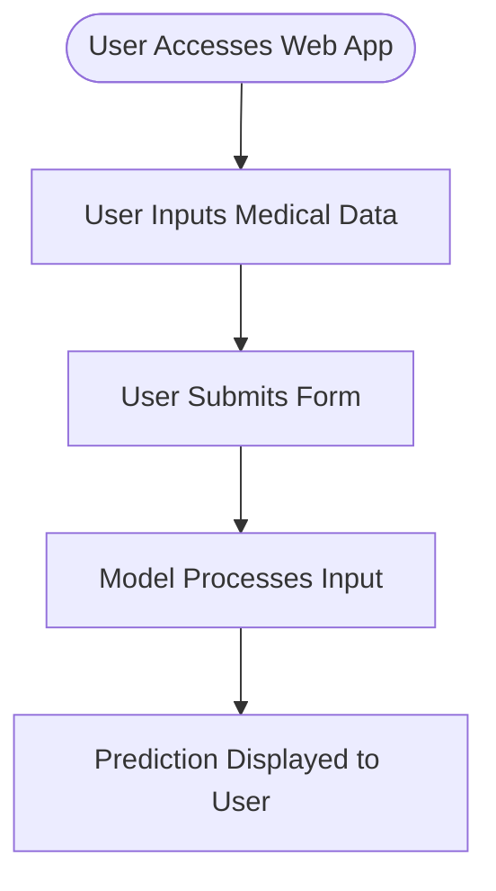

# DiabPredict – Intelligent Diabetes Risk Predictor

DiabPredict is an intelligent web-based tool for predicting the risk of diabetes using machine learning. It provides an interactive interface for users to input health parameters and instantly see their risk assessment. The project leverages well-established ML models, ensures transparency in predictions, and aims to support early intervention for diabetes.

## Features

- Predicts diabetes risk based on user-provided medical attributes.
- Utilizes advanced machine learning models for accurate predictions.
- Intuitive, user-friendly web interface.
- Real-time results and instant feedback.
- Visualizations and explanations for prediction results.
- Secure handling of user data.
- Extensible and modular codebase for adding new features and models.

## Requirements

To run DiabPredict locally, ensure you have the following:

- Python 3.7+
- pip package manager
- Virtual environment tool (optional but recommended)
- The following Python packages:
  - Flask
  - scikit-learn
  - pandas
  - numpy
  - matplotlib
  - seaborn
  - joblib
  - (Others as specified in `requirements.txt`)

## Installation

Follow these steps to get DiabPredict running on your local machine:

1. **Clone the repository:**
   ```bash
   git clone https://github.com/arman-singh-18/DiabPredict-Intelligent-Diabetes-Risk-Predictor.git
   cd DiabPredict-Intelligent-Diabetes-Risk-Predictor
   ```

2. **Create a virtual environment (recommended):**
   ```bash
   python -m venv venv
   source venv/bin/activate  # On Windows: venv\Scripts\activate
   ```

3. **Install dependencies:**
   ```bash
   pip install -r requirements.txt
   ```

4. **Run the application:**
   ```bash
   python app.py
   ```

5. **Open your browser and navigate to:**
   ```
   http://127.0.0.1:5000/
   ```

## Usage

Once the application is running:

- Enter the required medical parameters (e.g., age, BMI, blood pressure, glucose level, etc.) in the form.
- Click the "Predict" button.
- View your diabetes risk prediction and additional visualizations.
- Use the provided insights for guidance and discussion with healthcare professionals.

### Example Workflow



## Configuration

DiabPredict supports basic configuration options:

- **Model Selection:** You can update or retrain the ML model by replacing the model file (e.g., `model.pkl`).
- **Thresholds:** Adjust risk thresholds in the backend code to fine-tune sensitivity/specificity.
- **Port:** By default, Flask runs on port 5000. Modify this in `app.py` if needed.

For advanced configuration, see inline comments in the codebase.

## Contributing

We welcome contributions! To contribute:

- Fork the repository.
- Create a new branch for your feature or bugfix.
- Write clear, well-documented code and add appropriate tests.
- Submit a pull request describing your changes.

### Guidelines

- Follow PEP8 for Python code style.
- Add docstrings and comments for clarity.
- Ensure new features do not break existing functionality.
- Update documentation as needed.

## License

This project is licensed under the MIT License.

---

```
MIT License

Copyright (c) 2024 arman-singh-18

Permission is hereby granted, free of charge, to any person obtaining a copy
of this software and associated documentation files (the "Software"), to deal
in the Software without restriction, including without limitation the rights
to use, copy, modify, merge, publish, distribute, sublicense, and/or sell
copies of the Software, and to permit persons to whom the Software is
furnished to do so, subject to the following conditions:

The above copyright notice and this permission notice shall be included in all
copies or substantial portions of the Software.

THE SOFTWARE IS PROVIDED "AS IS", WITHOUT WARRANTY OF ANY KIND, EXPRESS OR
IMPLIED, INCLUDING BUT NOT LIMITED TO THE WARRANTIES OF MERCHANTABILITY,
FITNESS FOR A PARTICULAR PURPOSE AND NONINFRINGEMENT. IN NO EVENT SHALL THE
AUTHORS OR COPYRIGHT HOLDERS BE LIABLE FOR ANY CLAIM, DAMAGES OR OTHER
LIABILITY, WHETHER IN AN ACTION OF CONTRACT, TORT OR OTHERWISE, ARISING FROM,
OUT OF OR IN CONNECTION WITH THE SOFTWARE OR THE USE OR OTHER DEALINGS IN THE
SOFTWARE.
```